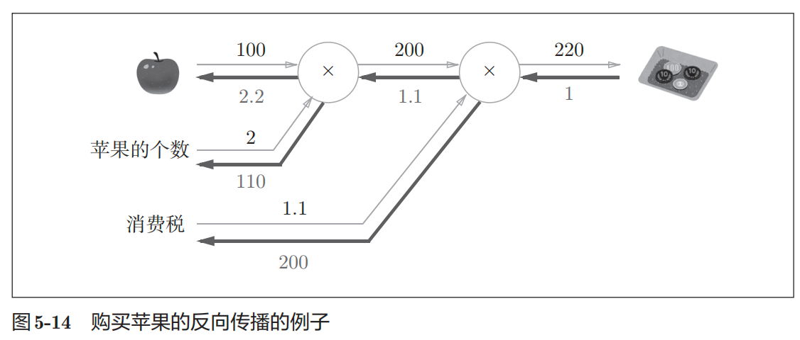

[toc]               

# 【1】python基础

## 【1.3】python解释器

```python
# 1.3.2 数据类型
print("=== 1.3.2 数据类型")
print(type(10))
print(type(3.14))
print(type("hello"))
# <class 'int'>
# <class 'float'>
# <class 'str'>

# 1.3.4 列表
a = [1, 2, 3, 4, 5]
print(a)
```

<br>

---

## 【1.5】NumPy

1）numpy定义：数组和矩阵的计算库；

```python
import numpy as np

# 生成numpy数组
print("==== 生成numpy数组")
x = np.array([1, 2, 3])
print(x)
print(type(x))
# [1 2 3]
# <class 'numpy.ndarray'>

# numpy的算术运算
print("=== numpy的算术运算")
x = np.array([1, 2, 3])
y = np.array([4, 5, 6])
print(x + y)
print(x - y)
print(x * y)
print(x / y)
# [5 7 9]
# [-3 -3 -3]
# [ 4 10 18]
# [0.25 0.4  0.5 ]

# numpy的n维数组
print("\n=== # 1.5.4 numpy的n维数组")
A = np.array([[1,2], [3,4]])
print(A)
print(A.shape)
print(A.dtype)
# [[1 2]
#  [3 4]]
# (2, 2)
# int64

print("\n=== 1.5.4 矩阵加法与乘法")
B = np.array([[3,0], [0,6]])
print(A+B)
print(A*B)
# [[ 4  2]
#  [ 3 10]]
# [[ 3  0]
#  [ 0 24]]


print("\n=== 矩阵广播")
print(A*10)
# [[10 20]
#  [30 40]]

print("\n=== 1.5.5 广播")
A= np.array([[1,2], [3,4]])
B= np.array([10,20])
print(A*B)
# [[10 40]
#  [30 80]]

print("\n=== 1.5.6 访问元素")
x = np.array([[51, 55],[14, 19],[0,4]])
print(x)
print(x[0])
print(x[0][1])
# [[51 55]
#  [14 19]
#  [ 0  4]]

# [51 55]
# 55

print("\n=== 使用数组访问各个元素")
x = x.flatten()
print(x)
# 获取索引0 2 4 的元素
print(x[np.array([0, 2, 4])])
# [51 55 14 19  0  4]
# [51 14  0]

# 筛选元素，类似于java流
print("\n=== 筛选元素，类似于java流")
print(x>15)
print(x[x>15])
# [ True  True False  True False False]
# [51 55 19]

```

<br>

---

## 【1.6】Matplotlib

1）Matplotlilb定义：Matplotlilb用于绘制图形的库。使用Matplotlib可以轻松绘制图形和实现数据的可视化；

```python
import numpy as np
import matplotlib.pyplot as plt
from matplotlib.image import imread

# 1.6 Matplotlib
# 使用Matplotlib可以绘制图形和实现数据的可视化

# 1.6.1 绘制简单图形
x = np.arange(0, 6, 0.1) # 以0.1为单位，生成0到6的数据
y = np.sin(x)

# 绘制图形
plt.plot(x, y)
plt.show()

# 1.6.2 pyplot功能
x = np.arange(0, 6, 0.1) # 以0.1为单位，生成0到6的数据
y1 = np.sin(x)
y2 = np.cos(x)

# 绘制图形
plt.plot(x, y1, label="sin")
plt.plot(x, y2, linestyle="--", label="cos") # 用虚线绘制
plt.xlabel("x") # x轴标签
plt.ylabel("y") # y轴标签
plt.title('sin & cos') # 标题
plt.legend()
plt.show()

# 1.6.3 显示图像  pyplot提供了用于显示图像的方法 imshow()
# from matplotlib.image import imread
img = imread('../img/doge.jpeg')
plt.imshow(img)
plt.show()

```

<br>

---

# 【2】感知机

感知机定义：接受多个输入信号，得到1个输出信号的算法；如与门，与非门，或门；

## 【2.3】感知机的实现

```python
import numpy as np

# 2.3.1 简单感知机 与门
print("\n=== 2.3.1 简单感知机 与门")


def AND(x1, x2):
    w1, w2, theta = 0.5, 0.5, 0.7
    temp = x1 * w1 + x2 * w2
    if temp <= theta:
        return 0
    elif temp > theta:
        return 1


print(AND(0, 0))
print(AND(1, 0))
print(AND(0, 1))
print(AND(1, 1))
# 0
# 0
# 0
# 1

print("\n=== 2.3.2 导入权重和偏置")
# 2.3.2 导入权重和偏置
x = np.array([0, 1])  # 输入
w = np.array([0.5, 0.5])  # 权重
b = -0.7
print(w * x)  # [0.  0.5]
print(np.sum(w * x))  # 0.5
print(np.sum(w * x) + b)  # -0.19999999999999996 大约为0.2

# 2.3.3 与门版本2 使用权重和偏置的实现与门
print("\n=== 2.3.3 与门版本2 使用权重和偏置的实现与门")
def AND_v2(x1, x2):
    x = np.array([x1, x2])
    w = np.array([0.5, 0.5])
    b = -0.7
    temp = np.sum(w * x) + b
    if temp <=0:
        return 0
    else:
        return 1
print(AND_v2(0, 0))
print(AND_v2(1, 0))
print(AND_v2(0, 1))
print(AND_v2(1, 1))
# 0
# 0
# 0
# 1

print("\n=== 非门 使用权重和偏置的实现非门")
def NON_AND(x1, x2):
    x = np.array([x1, x2])
    w = np.array([-0.5, -0.5]) # 权重与偏置与 AND不同
    b = 0.7
    temp = np.sum(w * x) + b
    if temp <= 0:
        return 0
    else:
        return 1
print(NON_AND(0, 0))
print(NON_AND(1, 0))
print(NON_AND(0, 1))
print(NON_AND(1, 1))
# 1
# 1
# 1
# 0

print("\n=== 或门 使用权重和偏置的实现或门")
def OR(x1, x2):
    x = np.array([x1, x2])
    w = np.array([0.5, 0.5]) # 权重与偏置与 AND不同
    b = -0.2
    temp = np.sum(w * x) + b
    if temp <= 0:
        return 0
    else:
        return 1
print(OR(0, 0))
print(OR(1, 0))
print(OR(0, 1))
print(OR(1, 1))
# 0
# 1
# 1
# 1

```

<br>

---

## 【2.4】感知机的局限性

1）感知机：无法表示异或门（当且仅当x1或x2中仅有一方等于1，才输出1，否则输出0）；

- 感知机的局限性：只能表示一条直线分割的空间，无法表示曲线分割的空间；
  - 非线性空间：被曲线分割的空间；
  - 线性空间：被直线分割的空间；


<br>

---

## 【2.5】多层感知机

1）多层感知机：多个感知机叠加或组合的感知机；

2）<font color=red>多层感知机的作用</font>：单层感知机无法实现异或门，但多个单层感知机叠加或组合后能够实现异或门；

<br>

---

### 【2.5.2】异或门的实现

```python
# 2.5.2 异或门的实现
print("\n=== 2.5.2 异或门的实现")


def XOR(x1, x2):
    s1 = NON_AND(x1, x2)
    s2 = OR(x2, x1)
    y = AND(s1, s2)
    return y


print(XOR(0, 0))
print(XOR(0, 1))
print(XOR(1, 0))
print(XOR(1, 1))
# 0
# 1
# 1
# 0
```

<br>

3）用感知机表示异或门的图例


<br>

## 【总结】

单层感知机只能表示线性空间，而多层感知机可以表示非线性空间； 

<br>

---

# 【3】神经网络

1）神经网络定义：自动从数据中学习到合适的权重参数的数学模型或计算模型；

---

## 【3.1】从感知机到神经网络

1）激活函数定义：把输入信号的总和转换为输出信号的函数；作用在于如何激活输入信号的总和；

如输入信号的总和为：  
$$
a = b + w1x1 + w2x2 
$$


输出信号为：
$$
y=h(a)
$$
则总和为a，函数h()把a转为输出y，则h()就是激活函数； 


<br>2）朴素感知机与多层感知机：

- 朴素感知机：单层网络，指激活函数使用了阶跃函数的模型；（阶跃函数指一旦输入超过阈值，就切换输出的函数，如分段函数）

- 多层感知机：指神经网络，即使用sigmoid函数等平滑的激活函数的多层网络；


<br>

---

## 【3.2】激活函数

1）激活函数定义：把输入信号的总和转换为输出信号的函数；作用在于如何激活输入信号的总和；

### 【3.2.1】sigmoid函数

1）sigmoid函数：神经网络中常用的一种激活函数；
$$
h(x)=\frac{1}{1+exp(-x)}
$$
其中 exp(-x)表示$$ e^{-x} $$ ，e是纳皮尔常数 2.7182...

<font color=red>补充：感知机与神经网络的主要区别</font>

- 感知机：使用阶跃函数作为激活函数；
- 神经网络：使用sigmoid函数作为激活函数；

<br>

---

### 【3.2.2】阶跃函数的实现

```python
# 阶跃函数
def step_function(x):
    y = x > 0
    return y.astype(int)

x = np.array([-1.0, 1.0, 2.0])
print(x)  # [-1.  1.  2.]
y = x > 0
print(y)  # [False  True  True]

# 布尔类型转为int型
print(y.astype(int)) # [0 1 1]
```

<br>

【阶跃函数的图形】

```python
import numpy as np
import matplotlib.pylab as plt

# 3.2.3 阶跃函数的图形
def step_function(x):
    return np.array(x>0, dtype=int)

x = np.arange(-5.0, 5.0, 0.1)
y = step_function(x)
plt.plot(x, y)
plt.ylim(-0.1, 1.1) # 指定y轴的范围
plt.show()

```


<br>

---

### 【3.2.4】sigmoid函数的实现

1）sigmoid函数：

```python
def sigmoid(x):
    return 1 / (1 + np.exp(-x))
```

### 【3.2.5】sigmoid函数和阶跃函数的比较

```python
import numpy as np
import matplotlib.pylab as plt

# 3.2.5 sigmoid函数和阶跃函数的比较
def sigmoid(x):
    return 1 / (1 + np.exp(-x))

# sigmoid 画图
x = np.arange(-5.0, 5.0, 0.1)
y = sigmoid(x)
plt.plot(x, y)
plt.ylim(-0.1, 1.1) # 指定y轴范围

# 阶跃函数画图
def step_function(x):
    return np.array(x>0, dtype=int)

x = np.arange(-5.0, 5.0, 0.1)
y = step_function(x)
plt.plot(x, y, linestyle='--')
plt.ylim(-0.1, 1.1) # 指定y轴的范围
plt.show()

```


<br>

### 【3.2.6】非线性函数

1）神经网络的激活函数，必须使用非线性函数； 

因为，为了发挥叠加层所带来的优势，神经网络的激活函数必须使用非线性函数；

<br> 

### 【3.2.7】ReLU函数

1）ReLU函数定义： 整流线性单位函数（Rectified Linear Unit, ReLU），又称修正线性单元，<font color=red>是一种人工神经网络中常用的激励函数（activation function）</font>，通常指代以斜坡函数及其变种为代表的非线性函数。
2）比较常用的线性整流函数有斜坡函数：$$f(x)=max(0,x)$$。

3）ReLU函数的实例如下：
$$
h(x)=\begin{cases}
x \quad (x>0)\\
0 \quad (x<=0)\\
\end{cases}
$$


<br>

---

## 【3.4】3层神经网络的实现

### 【3.4.3】代码实现小结

1）神经网络代码实现小结

```python
import numpy as np

# 使用激活函数sigmoid转换神经元的加权和
def sigmoid(x):
    return 1 / (1 + np.exp(-x))

# identy_func : 是输出层的激活函数，也称恒等函数
def identity_func(x):
    return x

# 3.4.3 神经网络代码实现小结
def init_network():
    network = dict()
    network['W1'] = np.array([[0.1, 0.3, 0.5], [0.2, 0.4, 0.6]])
    network['b1'] = np.array([0.1, 0.2, 0.3])
    network['W2'] = np.array([[0.1, 0.4], [0.2, 0.5], [0.3, 0.6]])
    network['b2'] = np.array([0.1, 0.2])
    network['W3'] = np.array([[0.1, 0.3], [0.2, 0.4]])
    network['b3'] = np.array([0.1, 0.2])
    return network

# 前向传播
def forward(network, x):
    W1, W2, W3 = network['W1'], network['W2'], network['W3']
    b1, b2, b3 = network['b1'], network['b2'], network['b3']

    a1 = np.dot(x, W1) + b1
    z1 = sigmoid(a1)
    a2 = np.dot(z1, W2) + b2
    z2 = sigmoid(a2)
    a3 = np.dot(z2, W3) + b3
    y = identity_func(a3)

    return y

# 调用神经网络初始化函数，前向传播函数
network = init_network()
x = np.array([1.0, 0.5])
y = forward(network, x)
print(y) #[0.31682708 0.69627909]

```

【函数介绍】

- init_network()：初始化神经网络的权重和偏置；把权重和偏置保存到字典变量network中；network字典变量保存了每一层所需的参数；
- forward()-前向函数：封装了将输入信号转为输出信号的过程；

2）神经网络输入信号到输出信号传递示意图


<br>

---

### 【3.4.4】三层神经网络结构 


<br>

---

## 【3.5】输出层的设计 

### 【3.5.1】激活函数分类

1）神经网络可以用在分类问题与回归问题上，不过需要根据实际情况修改激活函数；

- 回归问题：使用恒等函数作为激活函数； （恒等函数： identity_function）
- 分类问题：使用softmax函数作为激活函数；

<br>

---

### 【3.5.2】恒等函数

1）恒等函数定义：把输入按照原样输出的函数；如 f(x)=x ； 


<br>

---

### 【3.5.3】softmax函数

1）softmax函数定义：Softmax函数是一种将任意实数向量转化为概率分布的归一化指数函数，其输出向量的每个元素都在0到1之间，且所有元素的和为1。 

- softmanx作用：它主要用于多分类问题中，作为神经网络的最后一层输出层，将原始分数转化为表示每个类别概率的向量，从而使模型能够对不同类别进行概率预测。

2）softmax函数公式如下：
$$
y_k=\frac{exp(a_k)}{\sum_{i=1}^{n}exp(a_i)}
$$
softmax函数的图像如下。


3）softmax函数的代码实现：

```python
import numpy as np

# 3.5 输出层的设计
# 激活函数选择：
# 回归问题使用恒等函数， 分类问题使用softmax函数
a = np.array([0.3, 2.9, 4, 0])
exp_a = np.exp(a)  # 指数函数
print(exp_a)
# [ 1.34985881 18.17414537 54.59815003  1.        ]

print("\n=== 计算指数函数的和")
sum_exp_a = np.sum(exp_a)
print(sum_exp_a)  # 75.1221542101633

print("\n=== 计算softmax函数值")
y = exp_a / sum_exp_a
print(y)  # [0.01796885 0.2419279  0.72679159 0.01331165]


# 定义softmax函数
def softmax(x):
    exp_a = np.exp(x)  # 计算指数函数
    sum_exp_a = np.sum(exp_a)  # 指数函数值求和
    y = exp_a / sum_exp_a  # 每个元素的指数函数值 除以 求和值
    return y


# 定义解决溢出问题的softmax函数
def softmax_no_overflow(x):
    c = np.max(x)
    exp_a = np.exp(x - c)
    sum_exp_a = np.sum(exp_a)
    y = exp_a / sum_exp_a
    return y

# 验证解决溢出问题的softmax函数
print("\n=== 验证解决溢出问题的softmax函数")
x = np.array([0.3, 2.9, 4.0])
y = softmax_no_overflow(x)
print(y) # [0.01821127 0.24519181 0.73659691]
print(np.sum(y)) # 1.0
```

<br>

---

### 【3.5.4】求解机器学习问题总结（学习+推理）

1）求解机器学习问题步骤：包括学习与推理；

- 学习阶段：在学习阶段进行模型的学习；
- 推理阶段：在推理阶段，用学到的模型对未知的数据进行推理（分类）；

<br>

---

## 【3.6】手写数字识别（推理实践）

1）前向传播： 我们使用学习到的参数，先实现神经网络的推理处理，这个推理处理的过程称为神经网络的前向传播； 

### 【3.6.0】使用神经网络解决问题的步骤

- 步骤1：使用训练数据进行权重参数的学习；
- 步骤2：推理时，使用步骤1学习得到的参数，对输入数据进行分类； 

<br>

---

### 【3.6.1】MNIST数据集

1）导入数据集

```python
import numpy as np
import sys, os

sys.path.append(os.pardir)  # 为了导入父目录中的文件而设定
from dataset.mnist import load_mnist
from PIL import Image # PIL -> Python Image Library # python图像库


# 3.6.1 mnist 数据集
def img_show(img):
    # np.uint8(img) 这一句是 把 img 转换成 numpy 的无符号 8 位整数类型
    pil_img = Image.fromarray(np.uint8(img)) # 把numpy数组的图像数据转为PIL对象
    pil_img.show()


# 读取mnist数据集 , flatten=True表示读入的图像是一维的，
(x_train, t_train), (x_test, t_test) = load_mnist(flatten=True, normalize=False, one_hot_label=False)
img = x_train[0]
lable = t_train[0]
print(lable)  # 训练集的测试标签 5

print(img.shape)  # (784,)
img = img.reshape(28, 28)  # 读入的图像是一维的，显示时，需要把图像的形状变为原来的尺寸(28 * 28 )
print(img.shape)  # (28, 28)

# 显示图像
img_show(img)

```

【代码解说】

- sys.path.append(os.pardir) 作用：

  - sys.path：这是一个Python 列表，它包含了Python 解释器在导入（import）模块时会查找的所有目录路径。

  - os.pardir：这是 os 模块中的一个常量，它代表字符串 '..'，表示当前目录的父目录或上一级目录。

  - append() 方法：这是Python 列表的一个方法，用于在列表的末尾添加一个元素。
  - 当前目录的父目录添加到python解释器用于查找模块的目录中去，使用以后，python就可以找到当前目录的父目录中的模块。

- 使用 load_minst函数可以轻松读入MNIST数据。

<br>

---

### 【3.6.2】神经网络的推理处理 

1）针对MNIST书记实现神经网络的推理处理：

- 神经网络输入层有784个神经元（28 * 28），因为图像大小=28*28；
- 输出层有 10 个神经元（数字0-9，共10个类别） ；
- 神经网络共有2个隐藏层：
  - 第1层有50个神经元；
  - 第2层有100个神经元；

2）推理处理代码：

【推理函数】

```python
import numpy as np
import pickle
import sys, os
from common.neural_network_active_func import sigmoid, softmax_no_overflow
sys.path.append(os.pardir) # 为了导入父目录中的文件而设定
from dataset.mnist import load_mnist

# 3.6.2 神经网络的推理处理
def get_data():
    # 获取测试数据，包括测试图像，测试标签
    (x_train, t_train), (x_test, t_test) = load_mnist(flatten=True, normalize=False, one_hot_label=False)
    return x_test, t_test

def init_network():
    # 读入保存在pickle文件sample_weight.pkl中学习到的权重参数
    with open("../dataset/sample_weight.pkl", "rb") as f:
        network = pickle.load(f)
    return network

# 预测分类
def predict(network, x):
    W1, W2, W3 = network["W1"], network["W2"], network["W3"]
    b1, b2, b3 = network["b1"], network["b2"], network["b3"]

    a1 = np.dot(x, W1) + b1
    z1 = sigmoid(a1)
    a2 = np.dot(z1, W2) + b2
    z2 = sigmoid(a2)
    a3 = np.dot(z2, W3) + b3
    y = softmax_no_overflow(a3)

    return y
```

【推理执行】

```python
import numpy as np
import pickle
import sys, os
from common.neural_network_active_func import sigmoid, softmax_no_overflow

sys.path.append(os.pardir)  # 为了导入父目录中的文件而设定
from dataset.mnist import load_mnist
import test3_6_1_neural_network_infer_func as infer_func

# 3.6.2 神经网络的推理处理


# ******************** 执行神经网络的推理处理
x, t = infer_func.get_data()  # 获取测试数据，包括测试图像x，测试标签t
network = infer_func.init_network()  # 初始化神经网络(读入保存在pickle文件sample_weight.pkl中学习到的权重参数)

accuracy_cnt = 0  # 识别准确的个数
for i in range(len(x)):  # 遍历测试图像x
    # 预测分类
    y = infer_func.predict(network, x[i])  # 预测得到预测值
    p = np.argmax(y)  # 获取y的数组中最大值的索引
    if p == t[i]:
        accuracy_cnt += 1

print("accuracy: ", str(float(accuracy_cnt / len(x))))
# accuracy:  0.9207

```

【补充】

- sample_weight.pkl  权重参数文件，从 [源码官网](https://www.ituring.com.cn/book/1921)下载

<br>

---

### 【3.6.3】批处理 

1）批处理定义： 对输入信号批量处理，提高处理效率；

- 批：打包式的输入数据称为批； 

2）输出3.6.2中神经网络的各层形状； 

```python
import sys, os
sys.path.append(os.pardir)  # 为了导入父目录中的文件而设定
import test3_6_1_neural_network_infer_func as infer_func

# 3.6.3 批处理
# 打印神经网络各层形状
x, _ = infer_func.get_data()
network = infer_func.init_network()
W1, W2, W3 = network['W1'], network['W2'], network['W3']
print(x.shape)  # (10000, 784)
print(x[0].shape)  # (784,)  输入层，第0层
print(W1.shape)  # (784, 50)  中间层，第1层
print(W2.shape)  # (50, 100)  中间层，第2层
print(W3.shape)  # (100, 10)  输出层， 第3层
```

3）基于批处理的神经网络推理代码实现：

```python
import sys, os
import numpy as np

sys.path.append(os.pardir)  # 为了导入父目录中的文件而设定
import test3_6_1_neural_network_infer_func as infer_func

# 【基于批处理的神经网络推理代码实现】 
x, t = infer_func.get_data()  # x=测试集 t=测试标签
network = infer_func.init_network()

# 批次数量
batch_size = 2000
accuracy_cnt = 0
print(x.shape) # (10000, 784)
print(t.shape) # (10000,)

# 基于批处理的推理
for i in range(0, len(x), batch_size):
    x_batch = x[i:i + batch_size] # 取出分批数据，每批一个单位
    print(x_batch.shape) # (2000, 784)
    y_batch = infer_func.predict(network, x_batch) # 以批为单位执行预测分类，得到概率数组
    print(y_batch.shape) # (2000, 10)
    p = np.argmax(y_batch, axis=1) # 概率最大的索引
    accuracy_cnt += np.sum(p == t[i:i + batch_size])

print("预测准确率 = " + str(float(accuracy_cnt / len(x))))
# 预测准确率 = 0.9207
```

<br>

---

# 【4】神经网络的学习

1）学习定义： 指从训练数据中自动获取最优权重参数的过程； 

### 【4.1.2】训练数据与测试数据

1）泛化能力：指处理未被观察过的数据的能力。获得泛化能力是机器学习的最终目标； 

2）为了准确评价模型的泛化能力，必须划分训练数据和测试数据；

- 训练数据：包括训练特征，训练标签；
- 测试数据：包括测试特征，测试标签；

<br>

---

## 【4.2】损失函数

1）损失函数定义： 神经网络寻找最优权重参数的指标；

- 损失函数：表示神经网络性能的恶劣程度（不拟合程度）的指标，即当前的神经网络对监督数据在多大程度上不拟合；

<br>

### 【4.2.1】均方误差

1）均方误差定义：表示预测值与真实值间差值的平方的均值。

公式如下：
$$
E=\frac{1}{2}\sum_{i=1}^{n}(y_i-t_i)^2
$$
2）代码实现：

```python
import numpy as np

# 均方误差函数
def mean_squared_error(y, t):
    return 0.5 * np.sum((y-t) ** 2)

# 测试 均方误差函数
# 例1： 索引为2的概率最高，0.6
y1 = [0.1, 0.05, 0.6, 0.0, 0.05, 0.1, 0.0, 0.1, 0.0, 0.0]
t = [0, 0, 1, 0, 0, 0, 0, 0, 0, 0]
print(mean_squared_error(np.array(y1), np.array(t))) # 0.09750000000000003

# 例2： 索引为7的概率最高 0.6
y2 = [0.1, 0.05, 0.1, 0.0, 0.05, 0.1, 0.0, 0.6, 0.0, 0.0]
print(mean_squared_error(np.array(y2), np.array(t))) # 0.5975
```

<br>

---

### 【4.2.2】交叉熵误差

1）交叉熵误差定义：度量两个概率分布间的差异；

- 熵定义：无损编码事件信息的最小平均编码长度。

公式如下：
$$
E=-\sum_{i=1}^{n}t_i\log{y_i}
$$

- 其中， $y_i$是神经网络输出，$t_i$是正确解标签（取值1）； 
- $t_i$中只有正确解标签的索引为1，其他均为0（one-hot表示）
- 因此，上述公式实际上只计算对应正确解标签的输出的自然对数；
- <font color=red>交叉熵误差的值</font>：是由正确解标签所对应的输出结果决定的； 
  - 如，正确解标签索引是2，对应的神经网络输出是0.6，则交叉熵损失是 $-\log{0.6}$=0.51

2）$y=-\log{x}$图像（辅助理解交叉熵损失函数）：

```python
import numpy as np
import matplotlib.pylab as plt

# y = -log(x) 图像
def minus_log_func(x):
    return np.array(-np.log(x))

x = np.arange(0.0001, 1.1, 0.0001)
print(x)
y = minus_log_func(x)
print(y)
plt.plot(x, y)
plt.ylim(0.0, 5.0) # 指定y轴的范围
plt.show()

```


3）python代码实现：

```python
import numpy as np

# 交叉熵损失函数 cross entropy error
def cross_entropy_error(y, t):
    delta = 1e-7
    return -np.sum(t * np.log(y + delta))

# 测试 交叉熵损失函数
# 例1： 索引为2的概率最高，0.6
y1 = [0.1, 0.05, 0.6, 0.0, 0.05, 0.1, 0.0, 0.1, 0.0, 0.0]
t = [0, 0, 1, 0, 0, 0, 0, 0, 0, 0]
print(cross_entropy_error(np.array(y1), np.array(t))) # 0.510825457099338

# 例2： 索引为7的概率最高 0.6
y2 = [0.1, 0.05, 0.1, 0.0, 0.05, 0.1, 0.0, 0.6, 0.0, 0.0]
print(cross_entropy_error(np.array(y2), np.array(t))) # 2.302584092994546
```

【补充】

函数内部在计算np.log时，加上了一个微小值delta。这是因为当出现np.log(0)时，np.log(0)会变为负无限大的-inf，这会导致计算无法正常进行。

<br>

---

### 【4.2.3】mini-batch学习（小批量学习）

1）mini-batch学习定义： 神经网络从训练数据中选出一批数据（称为mini-batch，小批量），然后对每个mini-batch进行学习；

- 如，从60000个训练数据中随机选择100笔作为mini-batch，然后再针对这个mini-batch进行学习；

2）计算所有训练数据的交叉熵误差（<font color=red>把单个数据的交叉熵误差扩展到N份数据</font>）：
$$
E=-\frac{1}{N}\sum_{i}^{n}\sum_{j}^{m}t_{ij}\log{y_{ij}}
$$

- 其中 $t_{ij}$表示第i个数据项的第j个元素的值， 其中$y_{ij}$ 是神经网络输出，$t_{ij}$ 是标签数据；
- 通过除以n，可以计算单个数据的平均损失函数；
- 通过平均化，可以获得和训练数据的数据无关的统一指标； 

3）代码实现抽取mini-batch：

```python
import sys, os
sys.path.append(os.pardir)
import numpy as np
from dataset.mnist import load_mnist

# 导入mnist 数据集
(x_train, t_train), (x_test, t_test) = load_mnist(normalize=True, one_hot_label=True)
# x_train 训练特征
# t_train 测试特征
# x_test 训练标签 
# t_test 测试标签 

# 打印mnist数据集中训练数据，测试数据的形状
print(x_train.shape) # (60000, 784)
print(t_train.shape) # (60000, 10)

# 抽取小批量-minibatch
print("\n=== 抽取小批量-minibatch ")
train_size = x_train.shape[0]
print("train_size:", train_size) # train_size: 60000
batch_size = 10
# np.random.choice(60000， 10) 从0到59999之间随机选择10个数字
batch_mask = np.random.choice(train_size, batch_size)
print(batch_mask) # [48518 20742 15521 28731 49193 47555 22867 15607 56529 53532]

print("\n=== 选择的小批量数据如下：")
x_batch = x_train[batch_mask]
t_batch = t_train[batch_mask]
print(x_batch)
print(t_batch)
```

【补充】

```python
# x_train 表示训练特征
# t_train 表示训练标签
# x_test  表示测试特征
# t_test  表示测试标签
```

<br>

---

### 【4.2.4】mini-batch版本的交叉熵误差实现 

1）实现可以同时处理单个和批量数据（mini-batch）的两种情况的函数；

函数1）one-hot标签的mini-batch版本的交叉熵损失函数 ：

```python
# one-hot标签的mini-batch版本的交叉熵损失函数 cross entropy error
def one_hot_mini_batch_cross_entropy_error(y, t):
    # 若轴个数为1，即一维数组，则转为二维数组 
    # ndim表示轴个数 
    if y.ndim == 1:
        t = t.reshape(1, t.size)
        y = y.reshape(1, y.size)
    # y向量在第0轴的长度
    batch_size = y.shape[0]
    return -np.sum(t * np.log(y + 1e-7)) / batch_size
```

【补充】one-hot标签指0 1 标签，即标签数据t向量的取值为0或1 ； 


函数2）非one-hot标签的mini-batch版本的交叉熵损失函数：

```python
# 非one-hot标签的mini-batch版本的交叉熵损失函数 cross entropy error
def non_one_hot_mini_batch_cross_entropy_error(y, t):
    if y.ndim == 1:
        t = t.reshape(1, t.size)
        y = y.reshape(1, y.size)
    batch_size = y.shape[0]
    return -np.sum(t * np.log(y[np.arange(batch_size), t] + 1e-7)) / batch_size
```

<br>

---

## 【4.3】数值微分

### 【4.3.1】导数

导数定义：这个函数在这一点附近的变化率（即函数在这一点的切线斜率）。

1）导数公式：
$$
\frac{df(x)}{dx}=\lim\limits_{h \to 0}\frac{f(x+h)-f(x)}{h}
$$
2）导数的不好实现例子（因为有舍入误差）

【ch04_4_2_5_derivative】

```python
import sys, os

# 导数的不好实现例子
def numerical_diff(f, x):
    h = 10e-50
    return (f(x + h) - f(x)) / h

# 测试案例
def function_1(x):
    return x**2

# 计算导数
print(function_1(2+10e-50)) # 4.0
print(function_1(2)) # 4.0 
derivative = numerical_diff(function_1, 2)
print(derivative) # 0 错误结果 （准确结果应该是4）
```

【为什么是错误结果】

```python
# 因为默认情况下python没有办法精确表示 10e-50，而是用0来近似
print("\n\n=== np.float32 ")
print(np.float32(1e-50)) # 0.0
print(np.float64(1e-50)) # 1e-50 
```

3）ch04_4_2_5_derivative代码问题的解决方法

- 改动1：把微小值h修改为$10^{-4}$
- 改动2：修改函数的差分，把 $f(x+h)-f(x)$ 修改为 $f(x+h)-f(x-h)$ （<font color=red>称为中心差分</font>）

<br>

---

### 【4.3.2】数值微分的例子 

4）基于上述2个改动点实现数值微分（数值梯度）

<font color=red>数值微分（数值梯度）定义</font>：利用微小的差分求导数的过程；

【ch04_4_2_5_derivative_v2】

```python
import numpy as np
import matplotlib.pyplot as plt


# 基于中心差分的数值梯度
def numerical_diff_v2(f, x):
    h = 1e-4  # 0.0001
    return (f(x + h) - f(x - h)) / (2 * h)


# 测试案例
def function_1(x):
    return 0.01 * x ** 2 + 0.1 * x


x = np.arange(0.0, 20.0, 0.1)  # 以0.1为单位，从0到20的数组x
y = function_1(x)
plt.xlabel('x')
plt.ylabel('y')
plt.plot(x, y)
plt.show()

# 计算function_1函数在x=5， x=10处的导数
# 按照公式推到 导数=0.02x+0.1，所以在x=5的导数为0.2， 在x=10的导数为0.3
print(numerical_diff_v2(function_1, 5))  # 0.1999999999990898
print(numerical_diff_v2(function_1, 10))  # 0.2999999999986347
```

【结论】

- 函数的真实导数：在x=5的导数是0.2， 在x=10的导数是0.3；
- 而基于中心差分的导数计算结果分别是  0.19999999, 0.29999999 ；这与真实值非常接近，或者说误差非常小以至于基本可以认为他们是相等的；

【function_1函数图像】


<br>

---

### 【4.3.3】偏导数 

1）偏导数定义：指对多变量的函数（多元函数）其中一个变量求导，而其他变量保持不变的计算过程。求函数f对变量x的偏导的数学式为 $\frac{\partial f}{\partial x}$

- 导数定义：这个函数在这一点附近的变化率（即函数在这一点的切线斜率）。

2）例子： $f(x_0,x_1)=x_0^{2}+x_1^{2}$

```python
# 偏导数
# f(x0,x1) = x0^2 + x1 ^2
def function_2(x):
    return x[0]**2 + x[1]**2
    # return np.sum(x**2)
```

【$f(x_0,x_1)=x_0^{2}+x_1^{2}$图像代码实现】

```python
import numpy as np
import matplotlib.pylab as plt
from mpl_toolkits.mplot3d import Axes3D

# f(x0,x1) = x0^2 + x1 ^2 图像
# 创建x0和x1的网格
x0 = np.linspace(-5, 5, 200)
x1 = np.linspace(-5, 5, 200)
X0, X1 = np.meshgrid(x0, x1)

# 计算z值
Z = X0**2 + X1**2

# 创建3D图形
fig = plt.figure(figsize=(10, 8))
ax = fig.add_subplot(111, projection='3d')

# 绘制表面图
surf = ax.plot_surface(X0, X1, Z, cmap='viridis', alpha=0.8)

# 设置标签
ax.set_xlabel('x0')
ax.set_ylabel('x1')
ax.set_zlabel('z = x0² + x1²')
ax.set_title('z = x0² + x1²')

# 添加颜色条
fig.colorbar(surf, shrink=0.5, aspect=10)

# 显示图形
plt.tight_layout()
plt.show()
```


3）计算 f(x0,x1) 在$x_0$=3，$x_1$=4的偏导数

```python
import numpy as np
import matplotlib.pyplot as plt
import ch04_4_2_5_derivative_v2 as devivativeV2

# 计算偏导数
# 计算 f(x0,x1) 在x0=3，x1=4的偏导数
# f(x0,x1) = x0^2 + x1 ^2

# 计算 f(x0,x1) 在x0=3的偏导数，固定x1=4
def func_1(x0):
    return x0**2 + 4**2
print(devivativeV2.numerical_diff_v2(func_1, 3.0))
# 6.00000000000378

# 计算 f(x0,x1) 在x1=4的偏导数，固定x0=3 
def func_2(x1):
    return 3.0**2 + x1**2

print(devivativeV2.numerical_diff_v2(func_2, 4.0)) # 7.999999999999119
```

<br>

---

## 【4.4】梯度

1）梯度定义：多变量函数（多元函数）的全部变量的偏导数汇总的向量，形如$(\frac{\partial f}{\partial x_0},\frac{\partial f}{\partial x_1})$；

- <font color=red>梯度其他定义：表示各点处的函数值减小最多方向汇总后的向量</font>； 

2）数值梯度函数：

【ch04_4_4_gradient.py】

```python
import numpy as np
import matplotlib.pylab as plt
from mpl_toolkits.mplot3d import Axes3D

# 梯度
def numerical_gradient(f, x):
    h = 1e-4 # 0.0001
    grad = np.zeros_like(x) # 生成与x形状相同的所有元素都为0的数组

    # 遍历索引
    for index in range(x.size):
        temp_value = x[index]
        # f(x+h)的计算
        x[index] = temp_value +h
        fxh1 = f(x)

        # f(x-h)的计算
        x[index] = temp_value - h
        fxh2 = f(x)

        grad[index] = (fxh1 - fxh2) / (2*h)
        x[index] = temp_value # 还原值
    return grad
```

【测试案例】ch04_4_4_gradient_test.py

```python
import numpy as np
import matplotlib.pylab as plt
import ch04_4_4_gradient as grad
import ch04_4_3_3_partial_derivative_src_func as src_func2

# 计算梯度
# 计算在 (3,4)  (0,2) (3,0) 处的梯度
print(grad.numerical_gradient(src_func2.func2, np.array([3.0, 4.0])))
print(grad.numerical_gradient(src_func2.func2, np.array([0, 2.0])))
print(grad.numerical_gradient(src_func2.func2, np.array([3.0, 0.0])))
# [6. 8.]
# [0. 4.]
# [6. 0.]
```

<br>

---

### 【4.4.1】梯度法 

1）梯度法定义： 使用梯度来寻找损失函数最小值时的参数的方法；

- 补充：机器学习的主要任务是在学习时寻找最优参数，其中最优参数是损失函数取最小值的参数；

2）需要注意的是：<font color=red>梯度表示各点处的函数值减小最多的方向。因此无法保证梯度所指的方向就是函数的最小值方向</font>。如梯度方向指向局部最小值<font color=red>(极值)</font>方向，而不是全局最小值方向，而函数最小值指全局最小值）

- 补充：函数的极小值，最小值，以及被称为鞍点的地方，梯度为0 ； 
- 鞍点定义：从某个方向看是极大值，另一个方向看是极小值的点；

3）梯度法另一种定义：通过不断沿梯度方向前进，逐渐减小函数值（如损失函数）的方法；

- 梯度下降法：寻找函数最小值的梯度法；<font color=red>（一般情况下，神经网络或深度学习中，梯度法主要指梯度下降法）</font>
- 梯度上升法：寻找函数最大值的梯度法；（方向取反）

4）梯度法公式：
$$
\begin{split}
x_0=x_0-\eta\frac{\partial f}{\partial x} \\ 
x_1=x_1-\eta\frac{\partial f}{\partial x}
\end{split}\tag{梯度法公式}
$$
其中 $\eta$表示更新量，在神经网络的学习中，称为学习率；

- <font color=red>学习率定义</font>：指一次学习更新参数值的单位大小；如步长；
  - 学习率的确定：取0.01或0.001 ；
- 梯度法公式表示一次更新的式子，这个步骤会反复执行；也就是说，每一步都按照上述公式更新变量的值，通过反复执行该步骤，逐渐减小函数值； 

【梯度法代码实现】ch04_4_4_gradient_method_code.py

```python
import ch04_4_4_gradient as grad

# 梯度法（或梯度下降法）代码实现
# f指目标函数或损失函数， init_x初始化点，lr是学习率或步长，step_num是梯度法的重复次数
def gradient_descend(f, init_x, lr=0.01, step_num=100):
    x = init_x

    for i in range(step_num):
        grad_value = grad.numerical_gradient(f, x)
        x -= lr * grad_value

    return x
```

【梯度法测试案例】

```python
import numpy as np
import ch04_4_4_gradient_method_code as grad_method


# 梯度法（或梯度下降法）测试案例
def funcion_2(x):
    return x[0] ** 2 + x[1] ** 2

# 初始点(-3, 4)
init_x = np.array([-3.0, 4.0])
# 计算结果
minimum_point = grad_method.gradient_descend(funcion_2, init_x, lr=0.1, step_num=100)
print(minimum_point) # [-6.11110793e-10  8.14814391e-10]
```

【梯度法的更新过程】


<br>

---

【关于学习率设定问题】

```python
import numpy as np
import ch04_4_4_gradient_method_code as grad_method

# 梯度法（或梯度下降法）测试案例
def funcion_2(x):
    return x[0] ** 2 + x[1] ** 2

# 初始点(-3, 4)
init_x = np.array([-3.0, 4.0])

# 学习率过大的例子 lr=10.0
minimum_point = grad_method.gradient_descend(funcion_2, init_x, lr=10.0, step_num=100)
print(minimum_point) # [-2.58983747e+13 -1.29524862e+12]

# 学习率过小的例子 lr=1e-10
init_x = np.array([-3.0, 4.0])
minimum_point_2 = grad_method.gradient_descend(funcion_2, init_x, lr=1e-10, step_num=100)
print(minimum_point_2) # [-2.99999994  3.99999992]
```

上述实验结果表明，学习率为0.1学习到的函数最小值的点[-6.11110793e-10  8.14814391e-10]非常接近实际值(0,0)；

- 学习率过大：如lr=10，则得到的最小值点会是一个非常大的值；
- 学习率过小：如lr=1e-10，则得到的最小值点与初始点基本没有变化；

【<font color=red>超参数</font>】

- 超参数定义：超参数是人工设定的机器学习算法参数；（需要尝试多个值，以便找到一种可以使得学习顺利的参数）
- 学习率就是一种超参数；


<br>

---

### 【4.4.2】神经网络的梯度 

1）神经网络梯度定义：损失函数关于权重参数的梯度； 

2）例：神经网络梯度的数学表示；

神经网络W，损失函数L，则该神经网络梯度用$\frac{\partial L}{\partial W}$表示 
$$
W=\begin{pmatrix}
w_{11} & w_{12} & w_{13} \\
w_{21} & w_{22} & w_{23}
\end{pmatrix} \\
\frac{\partial L}{\partial W}=\begin{pmatrix}
\frac{\partial L}{\partial w_{11}} & \frac{\partial L}{\partial w_{12}} & \frac{\partial L}{\partial w_{13}} \\ 
\frac{\partial L}{\partial w_{21}} & \frac{\partial L}{\partial w_{22}} & \frac{\partial L}{\partial w_{23}} 
\end{pmatrix} \tag{4.8}
$$
其中L损失函数使用交叉熵损失函数（N份数据的交叉熵损失函数，tij是正确解标签，yij是输出信号或输出值）：
$$
 E=-\frac{1}{N}\sum_{i}^{n}\sum_{j}^{m}t_{ij}\log{y_{ij}}
$$
3）计算神经网络梯度代码：

【神经网络类】ch04_4_4_2_neural_network_gradient.py 

```python
import sys, os

from ch04.ch04_4_2_2_cross_entropy_error import cross_entropy_error
from common.neural_network_active_func import softmax_no_overflow
sys.path.append(os.pardir)
import numpy as np

class simpleNet:
    def __init__(self):
        self.W = np.random.randn(2, 3) # 用高斯分布进行初始化

    # 预测方法（预测产生输出信号z，其中x是输出信号，W是权重）
    def predict(self, x):
        return np.dot(x, self.W)

    # 计算损失， 其中x是输入特征，t是正确解标签
    def loss(self, x, t):
        z = self.predict(x) # x点乘权重，得到权重累加值
        # Softmax函数(激活函数)是一种将任意实数向量转化为概率分布的归一化指数函数，其输出向量的每个元素都在0到1之间，且所有元素的和为1
        y = softmax_no_overflow(z) #
        loss = cross_entropy_error(y, t) # 计算交叉熵损失函数（y是预测概率，t是测试标签或正确解标签）
        return loss

```

【计算神经网络梯度测试案例】ch04_4_4_2_neural_network_gradient_test.py

```python
import ch04_4_4_2_neural_network_gradient as net_grad
import numpy as np
from common.gradient import numerical_gradient

# 测试案例：计算神经网络的梯度
network = net_grad.simpleNet()
# 打印权重参数
print("\n===打印权重参数")
print(network.W)
# [[-1.01151507  0.29654086  0.54875784]
#  [-0.65483815  1.71663151  0.79564619]]


# 传入输入特征
x = np.array([0.6, 0.9])
# 计算输入特征x与神经网络权重w的加权和（输出信号）
p = network.predict(x)
print("\n=== 输入特征x与神经网络权重w的加权和：")
print(p)
# [-1.19626337  1.72289288  1.04533627]
print("\n=== 计算加权和最大的索引")
print(np.argmax(p))
# 1

print("\\n=== 计算损失函数： 计算输入特征x的预测概率与测试标签的交叉熵损失函数")
t = np.array([0, 0, 1]) # 正确解标签
print(network.loss(x, t))
# 1.1234180817699424


##  计算损失函数关于权值的梯度
print("\n=== 权值, network.W = ")
print(network.W)
# [[-0.78391423 -0.0493546   1.01982955]
#  [-0.1693144  -0.82591994 -0.70009164]]

print("\n=== 计算损失函数关于权值的梯度")
def busi_func(W):
    return network.loss(x,t)
dW = numerical_gradient(busi_func, network.W)
print(dW)
# [[ 0.16255973  0.13988719 -0.30244691]
#  [ 0.24383959  0.20983078 -0.45367037]]

```

【补充】上述代码的numerical_gradient是原书源代码中common包下的函数。[https://www.ituring.com.cn/book/1921](https://www.ituring.com.cn/book/1921)

【gradient.py】

```python
# coding: utf-8
import numpy as np

def _numerical_gradient_1d(f, x):
    h = 1e-4 # 0.0001
    grad = np.zeros_like(x)
    
    for idx in range(x.size):
        tmp_val = x[idx]
        x[idx] = float(tmp_val) + h
        fxh1 = f(x) # f(x+h)
        
        x[idx] = tmp_val - h 
        fxh2 = f(x) # f(x-h)
        grad[idx] = (fxh1 - fxh2) / (2*h)
        
        x[idx] = tmp_val # 还原值
        
    return grad


def numerical_gradient_2d(f, X):
    if X.ndim == 1:
        return _numerical_gradient_1d(f, X)
    else:
        grad = np.zeros_like(X)
        
        for idx, x in enumerate(X):
            grad[idx] = _numerical_gradient_1d(f, x)
        
        return grad


def numerical_gradient(f, x):
    h = 1e-4 # 0.0001
    grad = np.zeros_like(x)
    
    it = np.nditer(x, flags=['multi_index'], op_flags=[['readwrite']])
    while not it.finished:
        idx = it.multi_index
        tmp_val = x[idx]
        x[idx] = float(tmp_val) + h
        fxh1 = f(x) # f(x+h)
        
        x[idx] = tmp_val - h 
        fxh2 = f(x) # f(x-h)
        grad[idx] = (fxh1 - fxh2) / (2*h)
        
        x[idx] = tmp_val # 还原值
        it.iternext()   
        
    return grad
```

<br>

---

## 【4.5】学习算法的实现

学习定义：神经网络存在合适的权重和偏置，调整权重和偏置以便拟合训练数据的过程；

1）神经网络的学习步骤：

- 步骤1-选择mini-batch：从训练数据随机选择mini-batch（小批量数据）；
- 步骤2-计算梯度：为减小mini-batch损失函数的值，需要计算各个权重参数的梯度；
- 步骤3-更新参数：将权重参数沿着梯度方向进行微小更新；
- 步骤4-重复：重复步骤1、步骤2、步骤3；

2）随机梯度下降法定义：基于随机选择的mini-batch数据，使用梯度下降法更新参数的学习方法；

- 简称：SGD， stochastic gradient descent 

<br>

---

### 【4.5.1】2层神经网络的类

1）两层神经网络类-TwoLayerNet 

【TwoLayerNet】ch04_4_5_1_two_layer_net.py

```python
import numpy as np
import common.neural_network_active_func as net_func
import common.gradient as grad_func

# 两层神经网络类
class TwoLayerNet:
    def __init__(self, input_size, hidden_size, output_size, weight_init_std=0.01):
        # 初始化权重
        self.params = {}
        self.params['W1'] = weight_init_std * np.random.randn(input_size, hidden_size)
        self.params['b1'] = np.zeros(hidden_size)
        self.params['W2'] = weight_init_std * np.random.randn(hidden_size, output_size)
        self.params['b2'] = np.zeros(output_size)

    def predict(self, x):
        W1, W2 = self.params['W1'], self.params['W2']
        b1, b2 = self.params['b1'], self.params['b2']

        a1 = np.dot(x, W1) + b1 # 加权和  
        z1 = net_func.sigmoid(a1)  # 激活函数作用后的输出信号 
        a2 = np.dot(z1, W2) + b2
        y = net_func.softmax_no_overflow(a2) # 激活函数作用后的输出信号 

        return y

    # x:输入特征， t:标签
    def loss(self, x, t):
        y = self.predict(x)
        return net_func.cross_entropy_error(y, t)

    def accuracy(self, x, t):
        y = self.predict(x)
        y = np.argmax(y, axis=1) # 返回数组 y 沿着第1轴（axis=1）的最大值的索引（第1轴是列方向）
        t = np.argmax(t, axis=1)

        accuracy = np.sum(y == t) / float(x.shape[0])
        return accuracy

    # x:输入特征， t：标签
    # 计算神经网络损失函数关于权值及偏置的梯度
    def numerical_gradient(self, x, t):
        loss_W = lambda W: self.loss(x, t)

        grads = {}
        grads['W1'] = grad_func.numerical_gradient(loss_W, self.params['W1'])
        grads['b1'] = grad_func.numerical_gradient(loss_W, self.params['b1'])
        grads['W2'] = grad_func.numerical_gradient(loss_W, self.params['W2'])
        grads['b2'] = grad_func.numerical_gradient(loss_W, self.params['b2'])

        return grads
```

【代码解说】

- 因为输入数据是手写数字，图像大小是784（28 * 28），输出为10个类别，所以指定参数 input_size=784, output_size=10,把隐藏层神经元个数设置为一个合适值即可；
- 初始化方法\__init__ 会初始化权重参数； 
- 需要注意的是：权重参数使用符合高斯分布的随机数进行初始化，偏置使用0初始化； 

【补充】

- 误差反向传播法：一种告诉计算梯度的方法，是对 numeric_gradient()方法进行加速；

<br>

---

### 【4.5.2】mini-batch的实现

1）mini-batch学习定义：从训练数据中随机选择一部分数据（称为mini-batch，小批量），再以mini-batch为对象，使用梯度法更新参数的过程；

2）案例：以 TwoLayerNet类为对象，使用mnist数据集进行学习；

【ch04_4_5_2_mini_batch_two_layer_net_test_p114】 基于mini-batch的两层神经网络测试

```python
import numpy as np
import ch04_4_5_1_two_layer_net_p111 as two_layer_network
from dataset import mnist
from dataset.mnist import load_mnist
import common.time_utils as time_utils

# 加载minist数据集
(x_train, t_train), (x_test, t_test) = load_mnist(normalize=True, flatten=True, one_hot_label=True)
# 训练损失列表
train_loss_list = []

# 超参数
iters_num = 10 # 迭代次数应该设置为10000，设置为10仅本地演示
train_size = x_train.shape[0] # 训练集数据量
batch_size = 100  # mini-batch的大小（每批数据量）
learning_rate = 0.1 # 学习率

# 创建两层神经网络实例
network = two_layer_network.TwoLayerNet(input_size=784, hidden_size=50, output_size=10)

for i in range(iters_num):
    print(f"{time_utils.get_now_year_month_day_hour_minite_second()} 第{i}次训练开始")
    # 获取mini-batch
    batch_mask = np.random.choice(train_size, batch_size) # 获取mini-batch小批量
    x_batch = x_train[batch_mask] # mini-batch的训练集
    t_batch = t_train[batch_mask] # mini-batch的测试集

    # 计算梯度
    grad = network.numerical_gradient(x_batch, t_batch)
    # grad = network.gradient(x_batch, t_batch) # 高速版

    # 更新参数
    for key in ('W1', 'b1', 'W2', 'b2'):
        network.params[key] -= learning_rate * grad[key]

    # 记录学习过程
    loss = network.loss(x_batch, t_batch)
    train_loss_list.append(loss)
    print(f"{time_utils.get_now_year_month_day_hour_minite_second()} 第{i}次训练结束")

# 打印每次训练的损失
print("\n=== 打印每次训练的损失")
print(train_loss_list)
```

<br>

---

### 【4.5.3】基于测试数据的评价 

1）神经网络学习的最初目标是掌握泛化能力。

2）神经网络学习，需要确认是否发生过拟合；

- 过拟合定义：机器学习模型在训练集上表现极好，但对新数据或测试集表现差的现象；

【基于测试数据评价两层神经网络机器学习算法性能】

```python
import numpy as np
import ch04_4_5_1_two_layer_net_p111 as two_layer_network
from dataset import mnist
from dataset.mnist import load_mnist
import common.time_utils as time_utils

# 基于测试数据评价两层神经网络机器学习算法性能

 # 加载minist数据集
(x_train, t_train), (x_test, t_test) = load_mnist(normalize=True, flatten=True, one_hot_label=True)

# 超参数
iters_num = 10 # 迭代次数应该设置为10000，设置为10仅本地演示
batch_size = 100  # mini-batch的大小（每批数据量）
learning_rate = 0.1 # 学习率
train_size = x_train.shape[0] # 训练集数据量

# 训练损失列表
train_loss_list = []
train_acc_list = []
test_acc_list = []
# 平均每个epoch的重复次数（epoch：一个单位）
iter_per_epoch = max(train_size / batch_size, 1)

# 创建两层神经网络实例
network = two_layer_network.TwoLayerNet(input_size=784, hidden_size=50, output_size=10)

for i in range(iters_num):
    print(f"{time_utils.get_now_year_month_day_hour_minite_second()} 第{i}次训练开始")
    # 获取mini-batch
    batch_mask = np.random.choice(train_size, batch_size) # 获取mini-batch小批量
    x_batch = x_train[batch_mask] # mini-batch的训练集
    t_batch = t_train[batch_mask] # mini-batch的测试集

    # 计算梯度
    grad = network.numerical_gradient(x_batch, t_batch)
    # grad = network.gradient(x_batch, t_batch) # 高速版

    # 更新参数
    for key in ('W1', 'b1', 'W2', 'b2'):
        network.params[key] -= learning_rate * grad[key]

    # 记录学习过程
    loss = network.loss(x_batch, t_batch)
    train_loss_list.append(loss)
    print(f"{time_utils.get_now_year_month_day_hour_minite_second()} 第{i}次训练结束")
    
    # 计算每个epoch的识别精度 
    if i % iter_per_epoch == 0:
        train_acc = network.accuracy(x_train, t_train)
        test_acc = network.accuracy(x_test, t_test)
        train_acc_list.append(train_acc)
        test_acc_list.append(test_acc)
        print("train acc:", train_acc, "test acc:", test_acc)
    
# 打印每次训练的损失
print("\n=== 打印每次训练的损失")
print(train_loss_list)
```

<br>

---

## 【4.6】总结

- 机器学习中使用的数据集分为：训练数据与测试数据； 
  - 神经网络使用训练数据进行学习，用测试数据评价学习到的模型的泛化能力； 
- 神经网络学习目标：以损失函数为指标，更新权重参数，以使得损失函数的值减小；
- 数值微分：利用某个给定的微小值的差分求导数的过程； 
  - 数值微分作用：利用数值微分，可以计算权重参数的梯度；

<br>

---

# 【5】误差反向传播法

## 【5.1】计算图

1）计算图定义：用图形表示计算过程的方法；计算图的图形通过节点（圆圈）和箭头表示；

【例】计算图：表示张三在超市买2个苹果，3个橘子。其中苹果单价100，橘子单价150，消费税10%，则总支付金额通过计算图表示如下。


2）综上，用计算图解题的情况下，需要按如下流程进行：

- 构建计算图；
- 在计算图上，从左向右计算；

3）正向传播定义：从计算图出发点到结束点的传播；

- 反向传播定义：从结束点到出发点的传播；

<br>

---

### 【5.1.2】局部计算

1）局部计算定义：无论什么生成，都可以根据只与自己相关的信息输出接下来的结果；

- 换言之：各个节点处（圆圈表示）只需进行与自己有关的计算，不用考虑全局；

<br>

---

### 【5.1.3】为何用计算图解题

1）使用计算图解题的最大原因：可以通过反向传播高效计算导数；

2）基于反向传播的导数的传递；


【图解】

- 反向传播使用与正向传播相反的箭头表示（粗线）；
- 反向传播传递局部导数，把导数的值写在箭头的下方；

【总结】

- 计算图的优点：通过正向传播与反向传播高效计算各个变量的导数值； 

<br>

---

## 【5.2】链式法则 

### 【5.2.1】计算图的反向传播

【例】反向传播实例。（计算图的反向传播： 沿着与正方向相反的方向，乘上局部导数）

如下图：反向传播的计算顺序是，把输出信号E乘上节点的局部导数$\frac{\partial{y}}{\partial{x}}$，并把结果$E\frac{\partial{y}}{\partial{x}}$ 传递到前面的节点； 

-  局部导数指：正向传播中y关于x的导数$\frac{\partial{y}}{\partial{x}}$。如$y=x^2$，则局部导数为 $\frac{\partial{y}}{\partial{x}}=2x$，即把$2x$传递到前面的节点； 


---

【总结】反向传播的计算顺序

- 把正向传播第n+1个节点的输出信号E乘上该节点的局部导数，并把乘积传递给第n个节点的过程；

  - 局部导数定义：第n+1个节点的输出信号对第n+1个节点的输入信号求导；（即输入信号的变化斜率）

  

<br>

---

### 【5.2.2】什么是链式法则

1）链式法则定义：指复合函数的导数可以用复合函数的各个函数的导数的乘积表示的一种性质；

【例】复合函数（由多个函数构成的函数）
$$
z=(x+y)^2 是复合函数，由下面2个函数构成。\\ 
z=t^2 \\
t=x+y
\tag {5.3}
$$
由复合函数的链式法则性质可知，复合函数z关于x的导数的计算过程如下：
$$
\frac{\partial{z}}{\partial{x}}=\frac{\partial{z}}{\partial{t}}\frac{\partial{t}}{\partial{x}}=2t
\tag {5.4}
$$
<br>

---

### 【5.2.3】链式法则和计算图

1）使用计算图表示公式5.4的链式法则计算过程；

【图例】式5.4的计算图： 沿着与正方向相反的方向，乘上局部导数后传递


【总结】<font color=red>反向传播是基于链式法则的</font>。

2）把式子5.3的结果代入到图5-7，结果如图5-8所示。其中 $\frac{\partial{z}}{\partial{x}}=2(x+y), \frac{\partial{t}}{\partial{x}}=1$


<br>

---

## 【5.3】反向传播 

### 【5.3.1】加法节点的反向传播

1）<font color=red>加法节点的反向传播：会把上游（从右到左）传过来的导数$\frac{\partial{L}}{\partial{z}}$乘以1，然后传向下游</font>；

- 加法节点的反向传播：把输入信号输出到下一个节点即可；

- 加法节点的反向传播，如图5-9所示。


2）加法节点的正向传播与反向传播的例子：


<br>

---

### 【5.3.2】乘法节点的反向传播 

1）<font color=red>乘法节点的反向传播：会把上游（从右到左）传过来的导数$\frac{\partial{L}}{\partial{z}}$乘以正向传播输入信号的翻转值，然后传向下游</font>；

- 翻转值：是一种翻转关系，如图5-12所示。如正向传播是x，则其翻转值是y，即反向传播的传入信号是y；正向传播是y，则反向传播是x；


<br>

---

### 【5.3.3】苹果的例子

1）问题：苹果价格，苹果个数，消费税这3个变量各自如何影响最终支付金额；

2）解决方法：使用计算图的反向传播解决，求解过程如图5-14所示。



【练习】填写下图中反向传播的输入信号；


<br>

---

## 【5.4】简单层的实现

1）乘法层定义：计算图中的乘法节点；

2）加法层定义：计算图中的加法节点； 

补充：后面章节会把构建神经网络的层实现为一个类；这里提到的层是神经网络中的功能单位；

- 如负责sigmoid函数的Sigmoid、负责矩阵乘积的Affine都以层为单位进行实现；  
- 因此： 下文也通过以层为单位来实现乘法节点与加法节点； 

<br>

---

### 【5.4.1】乘法层的实现 

1）层的实现有2个通用的方法，包括forward()-正向传播， backward()-反向传播； 


【计算图的乘法层类】ch05_5_4_1_multiply_layer_p135

```python
# 计算图的乘法层类
class MulLayer():
    def __init__(self):
        self.x = None
        self.y = None

    # 正向传播， x与y都是输入信号
    def forward(self, x, y):
        self.x = x
        self.y = y
        out = x * y
        return out

    # 反向传播， dout是上游导数（从右到左）
    # backward()把从上游传来的导数dout乘以正向传播的翻转值，然后传给下游
    def backward(self, dout):
        dx = dout * self.y
        dy = dout * self.x
        return dx, dy
```

【计算图的乘法层类-测试案例】ch05_5_4_1_multiply_layer_test_p136

```python
import ch05_5_4_1_multiply_layer_p135 as multiply_layer

# 计算图的乘法层类-测试用例
apple_price = 100
apple_num = 2
tax = 1.1

# layer
multi_apple_layer_instance = multiply_layer.MulLayer() # 苹果乘法层
multi_tax_layer_instance = multiply_layer.MulLayer()  # 税率乘法层

# 苹果-前向传播
apple_price = multi_apple_layer_instance.forward(apple_price, apple_num)
# 把苹果总金额与税额向前传播，得到总金额
total_money = multi_tax_layer_instance.forward(apple_price, tax)

# 打印正向传播计算的支付的总金额
print("\n\n===打印正向传播计算的支付的总金额")
print(total_money) # 220.00000000000003

# 后向传播： 计算各个变量的导数
dprice = 1
# 税率乘法层的后向传播，得到苹果总价偏导数，税率偏导数
dapple_total_money, dtax = multi_tax_layer_instance.backward(dprice)
# 苹果乘法层的后向传播，得到苹果单价偏导数，苹果个数偏导数
dapple_price, dapple_num = multi_apple_layer_instance.backward(dapple_total_money)

# 打印通过后向传播计算得到的各变量的导数
print("\n=== 打印通过后向传播计算得到的各变量的导数")
print(dapple_price, dapple_num, dtax) # 2.2 110.00000000000001 200


```

<br>

---

### 【5.4.2】加法层的实现 

【计算图的加法层类】-ch05_5_4_2_add_layer_p137

```python
# 计算图的加法层类
class AddLayer:
    def __init__(self, x, y):
        pass

    def forward(self, x, y):
        out = x + y
        return out

    def backward(self, dout):
        dx = dout * 1
        dy = dout * 1
        return dx, dy
```


【计算图的加法层类-测试案例】

```python
from ch05.ch05_5_4_1_multiply_layer_p135 import MulLayer
from ch05.ch05_5_4_2_add_layer_p137 import AddLayer

# 计算图的加法层类的测试用例
apple_money_sum = 100
apple_num = 2
orange_money_sum = 150
orange_num = 3
tax = 1.1

# 创建乘法层与加法层实例
apple_mul_layer_ins = MulLayer() # 苹果乘法层
orange_mul_layer_ins = MulLayer()  # 橘子乘法层
apple_add_layer_ins = AddLayer()  # 苹果加法层
tax_mul_layer_ins = MulLayer()  # 税率乘法层 

# 苹果乘法层前向传播，得到苹果总价（支付总金额）
apple_money_sum = apple_mul_layer_ins.forward(apple_money_sum, apple_num) # (1)
# 橘子乘法层前向传播，得到橘子总价（支付总金额）
orange_money_sum = orange_mul_layer_ins.forward(orange_money_sum, orange_num)  # (2)
# 苹果加法层前向传播，得到苹果+橘子总价（支付总金额）
all_money_sum = apple_add_layer_ins.forward(apple_money_sum, orange_money_sum) #(3)
# 税率乘法层前向传播，得到计税后的支付总金额
taxed_total_money = tax_mul_layer_ins.forward(all_money_sum, tax)

# backward 后向传播
dtaxed_total_money = 1 # 计税后总金额导数为1
# 税率乘法层后向传播：得到计税后总金额对税前总金额偏导，税率偏导
duntax_total_money, dtax = tax_mul_layer_ins.backward(dtaxed_total_money)
# 苹果加法层后向传播： 得到苹果税前总金额偏导，橘子税前总金额偏导
duntax_apple_money_sum, duntax_orange_money_sum = apple_add_layer_ins.backward(duntax_total_money)
# 苹果加法层后向传播： 得到苹果单价偏导，苹果数量偏导
dapple_price, dapple_num = apple_mul_layer_ins.backward(duntax_apple_money_sum)
# 橘子加法层后向传播： 得到橘子单价偏导，橘子数量偏导
dorange_price, dorange_num = orange_mul_layer_ins.backward(duntax_orange_money_sum)

# 打印
print(f"后向传播：税前总金额偏导={duntax_total_money}, 税率偏导={dtax}")
print(f"后向传播：苹果税前总金额偏导={duntax_apple_money_sum}, 橘子税前总金额偏导={duntax_orange_money_sum}")
print(f"后向传播：苹果单价偏导={dapple_price}, 苹果数量偏导={dapple_num}")
print(f"后向传播：橘子单价偏导={dorange_price}, 橘子数量偏导={dorange_num}")
# 后向传播：税前总金额偏导=1.1, 税率偏导=650
# 后向传播：苹果税前总金额偏导=1.1, 橘子税前总金额偏导=1.1
# 后向传播：苹果单价偏导=2.2, 苹果数量偏导=110.00000000000001
# 后向传播：橘子单价偏导=3.3000000000000003, 橘子数量偏导=165.0
```

【苹果与橘子计算后支付总金额-神经网络层级模型图例】


<br>

---

## 【5.5】激活函数层的实现

### 【5.5.1】激活函数ReLU的神经网络层

1）激活函数ReLU表示如下：
$$
y=\begin{cases}
x& (x>0) \\
0& (x<=0)
\end{cases} \tag{5.7}
$$


2）激活函数ReLU求解关于x的导数：
$$
\frac{\partial y}{\partial x}=\begin{cases}1& (x>0) \\ 0& (x<=0)\end{cases} \tag{5.8}
$$
【公式解说】在公式5.8中，如果正向传播的输入x大于0，则反向传播会将上游的值原封不动地传给下游；

- 反过来： 如果正向传播的x小于等于0，则反向传播中传给下游的信号将停在此处；如图5-18所示。

3）ReLU的正向传播与反向传播，如下图所示。


4）激活函数ReLU类代码：

```python
class Relu:
    def init(self):
        self.mask = None

    def forward(self, x):
        self.mask = (x <= 0)
        out = x.copy()
        out[self.mask] = 0

        return out

    def backward(self, dout):
        dout[self.mask] = 0
        dx = dout
        return dx
```

5）relu中有mask实例变量：mask=(x<=0)的作用是x二维数组中元素小于等于0，则设置为true，否则设置为false；

```python
import numpy as np

x = np.array([[1.0, -0.5], [-2.0, 3.0]])
print(x)
# [[ 1.  -0.5]
#  [-2.   3. ]]

# x二维数组中元素小于等于0，则设置为true，否则设置为false
mask = (x<=0)
print(mask)
# [[False  True]
#  [ True False]]
```

<br>

---

### 【5.5.2】激活函数Sigmoid的神经网络层

1）激活函数Sigmoid表示如下： 
$$
y=\frac{1}{1+exp(-x)} \tag{5.9}
$$


2）公式5.9用计算图正向传播表示如下：


3）由公式5.9，推导出激活函数sigmoid的计算图反向传播，如下：


4）总结：图5-20演示了激活函数Sigmoid层的反向传播，省去中间步骤后，可以简洁表示如下。


其中 $\frac{\partial{L}}{partial{y}}y^2exp(-x)$ 整理如下：
$$
\begin{aligned} \frac{\partial{L}}{\partial{y}}y^2exp(-x)&=\frac{\partial{L}}{\partial{y}}\frac{1}{(1+exp(-x))^2}exp(-x)\\
&=\frac{\partial{L}}{\partial{y}}\frac{1}{1+exp(-x)}\frac{exp(-x)}{1+exp(-x)} \\
&=\frac{\partial{L}}{\partial{y}}y(1-y)
\end{aligned} \tag{5.12}
$$
5）所以：图5-21表示的sigmoid层的反向传播，只根据正向传播的输出就能够计算出来，如下。


6）激活函数sigmoid层的代码实现：

```python
import numpy as np

# 激活函数sigmoid层的代码实现
class Sigmoid():
    def __init__(self):
        self.out = None

    def forward(self, x):
        out = 1 / (1+np.exp(-x))
        self.out = out

        return out

    def backward(self, dout):
        dx = dout * (1.0-self.out)  * self.out
        return dx
```

<br>

---

## 【5.6】Affine/Softmax层的实现（激活函数Affine或Softmax的神经网络层实现）


